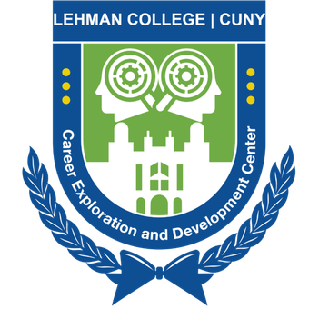

### Hi, my name is Mark 👋 and I ❤️ IT Operations and Backend Systems

**Field of interests**: System & Network Administration, CloudOps, Site Reliability Engineering

### Skills 🛠️

| Category             | Skills                                             |
|----------------------|----------------------------------------------------|
| **Programming**       | Python, PowerShell                                |
| **Data Architecture** | MySQL, Azure Data Studio, MS Access               |
| **Operating Systems** | Microsoft Windows, Linux, MacOS                   |

### Education 🎓
- Bachelor of Science in Computer Information Systems @ Lehman College CUNY (2025)

### Projects 🐾
- [Coming Soon](https://github.com/Mark-Munoz/muse_tf2pt) - Description of Project 
- [Coming Soon](https://github.com/Mark-Munoz/QaNER) - Description of Project 
- [Coming Soon](https://github.com/Mark-Munoz/rllib) - Description of Project 
- [Coming Soon](https://github.com/Mark-Munoz/muse-as-service) - Description of Project 

### Certifications 📜
- [Coming Soon](https://www.somewebsitesdf.com) @ Some Site 
- [Coming Soon](https://www.somewebsitesdf.com) @ Some Site 
- [Coming Soon](https://www.somewebsitesdf.com) @ Some Site 

### Achievements 🏆
- Coming Soon
- Coming Soon
- Coming Soon

### Badges 🏅

### GitHub Stats ⭐

More information in my [LinkedIn](https://www.linkedin.com/in/mark-munoz-b18a981a9/) 🚀
