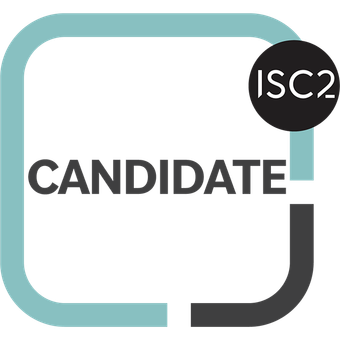

### Hi, my name is Mark 👋 and I ❤️ IT Operations & Backend Systems

**Field of interests**: System & Network Administration, Cloud Computing, DevOps, Site Reliability Engineering

### Skills 🛠️

| Category             | Skills                                             |
|----------------------|----------------------------------------------------|
| **Programming**       | Python, PowerShell, PHP, HTML, CSS                |
| **Data Architecture** | MySQL, Azure Data Studio, MS Access               |
| **Operating Systems** | Microsoft Windows, Linux, MacOS                   |

### Education 🎓
- Bachelor of Science in Computer Information Systems @ Lehman College CUNY (2025)

### Projects 🐾
- [Coming Soon](https://github.com/Mark-Munoz/muse_tf2pt) - Implemented Active Directory (On-Premises) in Azure 
- [Coming Soon](https://github.com/Mark-Munoz/QaNER) - Explored Network Concepts, Protocols, and VPN 
- [Coming Soon](https://github.com/Mark-Munoz/rllib) - Developed server web based application with database backend 
- [Coming Soon](https://github.com/Mark-Munoz/muse-as-service) - Analyzed customer churn data for telecomunications firm  

### Certifications 📜
- [Cerified PHP Developer (Professional Level)](https://verify.w3schools.com/1OTUY63OFV) @ W3 Schools 
- [Learn Python & Ethical Hacking from scratch](https://www.udemy.com/certificate/UC-64e4443f-a44c-439f-bdf5-3a9448f67b30/) @ Z Security 
- [Coming Soon](https://www.somewebsitesdf.com) @ Some Site 

### Achievements 🏆
- Awarded Dean's List 2022
- Departmental recognition for exceptional work in CIS 211

### Badges 🏅

### GitHub Stats ⭐

More information in my [LinkedIn](https://www.linkedin.com/in/mark-munoz-b18a981a9/) 🚀
